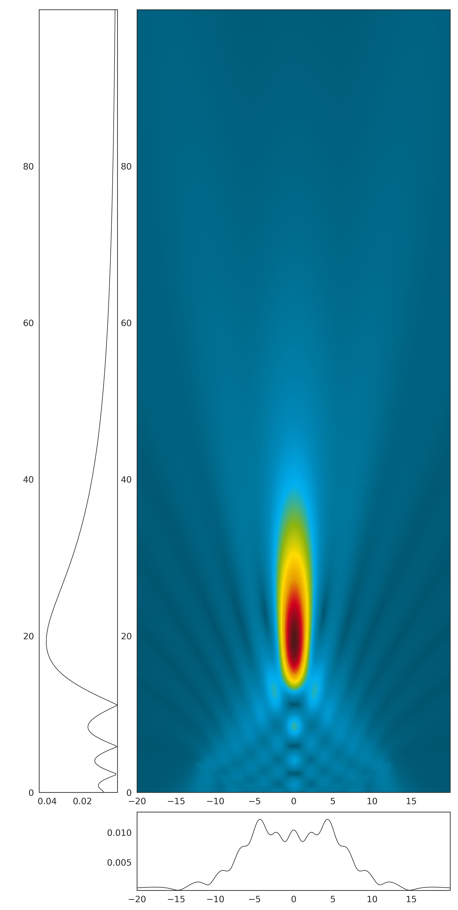
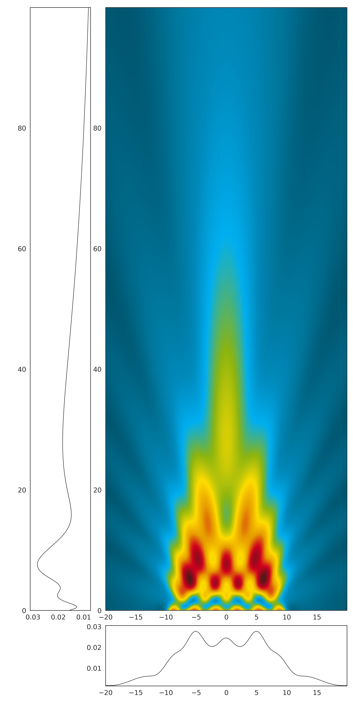
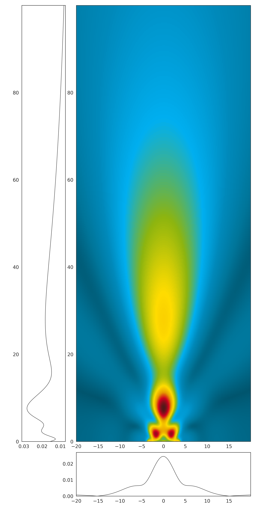

# GPSS

The presented code implements the generalized point source synthesis for acoustic sources. The numerical part is implemented and parallelized using the Cython frame work and runs in 2D or 3D. 

The code is mainly used to calculated sound field of arbitrary acoustic sources.

## Results

### Sperically focused circular source

Spherically focused and circular shaped transducer with a center frequency $f_{c}$ of 100 kHz, an aperture $D$ of 25 mm, and a curvature $r_{c}$ of 23 mm. 

### Non-focused rectangular source

